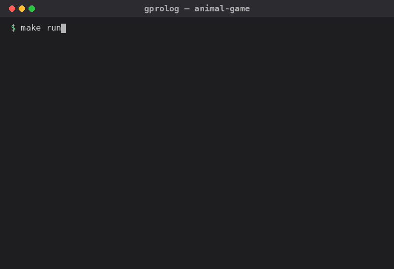
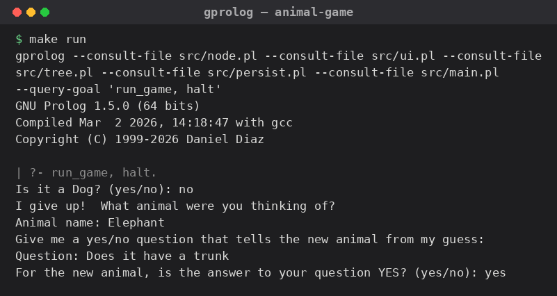

# Animal Game

[](https://github.com/raulkivi/ProAnimalGame/actions/workflows/test.yml)
[](LICENSE)
[](http://www.gprolog.org/)

A classic "20 questions" style guessing game written in **GNU Prolog**. The
computer tries to guess the animal you're thinking of by asking yes/no
questions. When it guesses wrong, you teach it a new animal and a question that
tells the two apart — so the program gets smarter every time you play. The
learned decision tree is saved to disk and reloaded on the next run.

<p align="center">
  
</p>

<details>
<summary>Text transcript (same session as the GIF above)</summary>

```
Is it a Dog? (yes/no): no
I give up!  What animal were you thinking of?
Animal name: Elephant
Give me a yes/no question that tells the new animal from my guess:
Question: Does it have a trunk
For the new animal, is the answer to your question YES? (yes/no): yes
Would you like to play again? (yes/no): yes
Does it have a trunk? (yes/no): yes
Is it a Elephant? (yes/no): yes
I win!
Would you like to play again? (yes/no): no
```

</details>

This is a companion port of the
[Forth implementation](https://github.com/raulkivi/AnimalGame) of the same
game — same design, re-expressed to play to Prolog's strengths (see
[*A bit about Prolog*](#a-bit-about-prolog) and
[*Where Prolog changes the design*](#where-prolog-changes-the-design)).

## Contents

1. [A bit about Prolog](#a-bit-about-prolog)
2. [Requirements](#requirements)
3. [Running](#running)
4. [How it works](#how-it-works)
5. [Where Prolog changes the design](#where-prolog-changes-the-design)
6. [Documentation](#documentation)
7. [Tests](#tests)
8. [For educators, students & Prolog enthusiasts](#for-educators-students--prolog-enthusiasts)
9. [License](#license)
10. [Sources & further reading](#sources--further-reading)

## A bit about Prolog

[Prolog](https://en.wikipedia.org/wiki/Prolog) ("**Pro**grammation en
**Log**ique") was created by **Alain Colmerauer** and **Philippe Roussel** in
Marseille in **1972**, building on **Robert Kowalski**'s procedural reading of
logic. It is the flagship *logic programming* language: instead of telling the
computer *how* to compute, you state facts and rules as Horn clauses and let the
engine search for answers by **unification** and **backtracking**. A program is
a set of relations; running it is proving a goal against them.

**Prolog and AI (the 1970s–80s golden age).** Prolog *was* mainstream AI for a
generation. Its pattern-matching and symbolic reasoning made it the natural
vehicle for expert systems, natural-language processing, planning, and theorem
proving, and Japan famously bet its **Fifth Generation Computer Systems**
project (1982–1992) on it. This little game sits squarely in that tradition: a
program that starts almost knowing nothing and **grows its own knowledge base**
— here, a binary decision tree — from what people tell it. In Prolog the fit is
especially snug, because the knowledge base is *literally a Prolog term* that
the language can read, write, and pattern-match natively.

**Prolog's influence.** The ideas Prolog popularized rippped outward:

- **Unification**, Prolog's core operation, is the same mechanism at the heart
  of **Hindley–Milner type inference** used by ML, Haskell, Rust, and Swift —
  every time such a compiler infers a type, it is unifying.
- **Datalog**, a decidable subset of Prolog, underpins modern
  deductive-database and static-analysis tools, and its bottom-up evaluation is
  the direct ancestor of **recursive queries** (`WITH RECURSIVE`) in standard
  SQL.
- **Erlang** — the language behind much of the world's telecoms and messaging
  infrastructure — was first *prototyped in Prolog* by Joe Armstrong, and its
  clause-and-pattern-matching syntax still shows the parentage.
- **Constraint Logic Programming** (CLP) and today's answer-set / SAT-adjacent
  solvers grew directly out of the Prolog research line.

The through-line: Prolog showed that **computation can be deduction** — that you
can describe *what is true* and let a search engine do the rest — an idea that
type systems, query languages, and rule engines carried into the mainstream.

## Requirements

- [GNU Prolog](http://www.gprolog.org/) (tested against 1.5.0)

```bash
# Debian/Ubuntu
sudo apt install gprolog
```

## Running

Run all commands **from the project root** — the save path (`data/tree.pl`) is
resolved relative to the process's working directory.

```bash
make run     # play the game
make test    # run all unit test suites
make clean   # delete the saved tree (data/tree.pl)
```

Individual test suites:

```bash
make test-node
make test-ui
make test-tree
make test-persist
```

<p align="center">
  
</p>

## How it works

The game is a binary decision tree:

- **Leaf (animal) nodes** — `animal(Name)` — hold an animal name: the guess.
- **Internal (question) nodes** — `question(Text, Yes, No)` — hold a yes/no
  question with a `Yes` child and a `No` child.

Play walks from the root, following the `Yes`/`No` branch of each question until
it reaches a leaf, then guesses that animal. A wrong guess triggers
**learning**: the leaf is replaced by a new question node whose two children are
the old animal and the newly taught one. The updated tree is saved to
`data/tree.pl` after every round and reloaded on the next launch (a one-leaf
seed tree — `animal('Dog')` — is used on first run).

## Where Prolog changes the design

The design (data structure, game loop, learning rule, module split) is faithful
to the Forth version; the *implementation* leans on things Prolog does that
Forth cannot:

| Concern | Forth version | Prolog version |
|---|---|---|
| Node | 5-cell heap block; `ALLOCATE` + `copy-str`; `free-node` to release | an ordinary term `animal/1` or `question/3` — built by unification, reclaimed by the GC (no `free-node` at all) |
| Learning mutation | patch the parent's *cell address* in place with one `!` | rebuild the path functionally: `traverse/3` relates `Tree` to a new `NewTree`, sharing every untouched subtree |
| Traversal | manual type flag + branching | clause **pattern matching** on `animal(_)` vs `question(_,_,_)` |
| Persistence | hand-written pre-order `Q`/`A` text parser | the **native reader/writer** — `writeq` to save, `read/1` to load; a corrupt file just fails to read and falls back to the seed |
| Swappable I/O & storage | `DEFER` words rebound in tests | a dynamic backend fact + `multifile` `backend_*` clauses, switched with `set_io_backend/1` / `set_repository/1` |

## Documentation

The full design specification and Prolog implementation reference — data
structure, game loop, learning algorithm, module layout and predicate-level
API, and the persistence format — live in
[`docs/AnimalGame.md`](docs/AnimalGame.md).

## Tests

Unit tests use a lightweight `assert_true/2` harness ([`tests/harness.pl`](tests/harness.pl))
and a scripted I/O backend ([`tests/scripted_io.pl`](tests/scripted_io.pl)) that
answers from queues instead of the terminal — so the game logic is exercised
without any real input. Each check is an `initialization/1` goal
(`:- initialization(assert_true('desc', Goal)).`); the wrapper is required
because GNU Prolog's byte-code loader runs only declaration directives and
`initialization/1` goals — a bare `:- assert_true(...)` is reported as an
unknown directive and silently skipped. All four suites should report success:

```bash
$ make test
test_node.pl: all tests passed (10 checks)
test_ui.pl: all tests passed (8 checks)
test_tree.pl: all tests passed (6 checks)
test_persist.pl: all tests passed (6 checks)
```

## For educators, students & Prolog enthusiasts

This project is small enough to read in one sitting but touches a real spread
of Prolog and software-design ideas, which makes it a decent teaching
artifact:

- **Unification as data construction.** The knowledge base isn't built with
  `assert`ed facts — it's a plain term (`animal/1` / `question/3`) grown and
  rebuilt by unification. `src/tree.pl`'s `traverse/3` is a compact example of
  "relate old state to new state" instead of mutating in place.
- **Clause-head pattern matching as dispatch.** No `if is_leaf(X) then ... else
  ...` anywhere — leaf vs. question is decided by which clause head unifies
  (see `traverse/3` in [`src/tree.pl`](src/tree.pl)).
- **Native read/write as a persistence layer.** [`src/persist.pl`](src/persist.pl)
  has no hand-rolled serializer — `writeq`/`read` *are* the format, so the
  save file and the in-memory term can never drift apart.
- **TDD with zero mocking framework.** [`tests/scripted_io.pl`](tests/scripted_io.pl)
  is a from-scratch test double for I/O, built entirely from the same
  `multifile`/dynamic-backend mechanism the production code uses — a clean,
  minimal illustration of dependency inversion in a language with no
  interfaces or classes.
- **A cross-paradigm comparison for free.** The
  [companion Forth port](https://github.com/raulkivi/AnimalGame) implements
  the *identical* spec — same tree, same learning rule, same test counts — so
  diffing the two READMEs' [design-decisions tables](#where-prolog-changes-the-design)
  is a ready-made "same problem, two paradigms" exercise.
- **A full spec, not just code.** [`docs/AnimalGame.md`](docs/AnimalGame.md)
  documents the data structure, game loop, learning algorithm, and
  predicate-level API with Mermaid diagrams — usable as assigned reading or as
  a template for how to *write* a design spec.

**Ideas for assignments / extensions**, roughly easiest first:

1. Port the game to SWI-Prolog and note every GNU-Prolog-specific workaround
   you have to remove (`docs/AnimalGame.md`'s
   [*Implementation notes*](docs/AnimalGame.md#implementation-notes-gnu-prolog-specifics)
   lists them).
2. Add a predicate that renders the current saved tree as a Mermaid
   `flowchart` (the tree is already a Prolog term — this is a `read/1` plus a
   recursive `format/2`).
3. Replace the seed tree with one loaded from a CSV/JSON dataset of animals.
4. Generalize `question/3` to an n-ary `question(Text, [Label-Child, ...])` so
   the game can ask multiple-choice, not just yes/no, questions — a good
   exercise in extending a closed data type without breaking existing tests.
5. Add tree-balancing: when the same distinguishing question would be asked on
   two different branches, merge them.

## License

[MIT](LICENSE)

## Sources & further reading

- *Prolog (programming language)* —
  [en.wikipedia.org/wiki/Prolog](https://en.wikipedia.org/wiki/Prolog)
  (Colmerauer & Roussel, Marseille, 1972).
- Alain Colmerauer & Philippe Roussel, *The Birth of Prolog* (ACM HOPL II) —
  [dl.acm.org/doi/10.1145/155360.155362](https://dl.acm.org/doi/10.1145/155360.155362).
- Robert Kowalski, *Predicate Logic as a Programming Language* (1974).
- *Fifth Generation Computer Systems* —
  [en.wikipedia.org/wiki/Fifth_Generation_Computer_Systems](https://en.wikipedia.org/wiki/Fifth_Generation_Computer_Systems).
- *GNU Prolog* — [gprolog.org](http://www.gprolog.org/).
- *Datalog* — [en.wikipedia.org/wiki/Datalog](https://en.wikipedia.org/wiki/Datalog);
  *Hindley–Milner type system* —
  [en.wikipedia.org/wiki/Hindley%E2%80%93Milner_type_system](https://en.wikipedia.org/wiki/Hindley%E2%80%93Milner_type_system).
