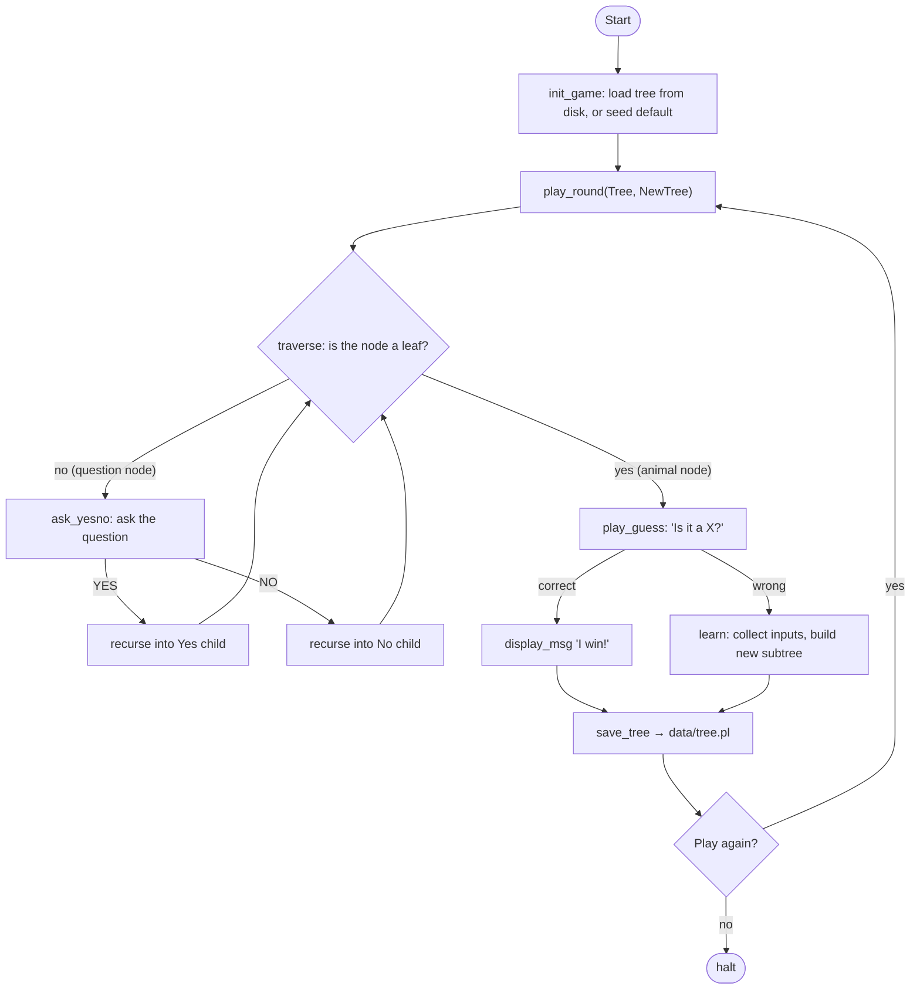
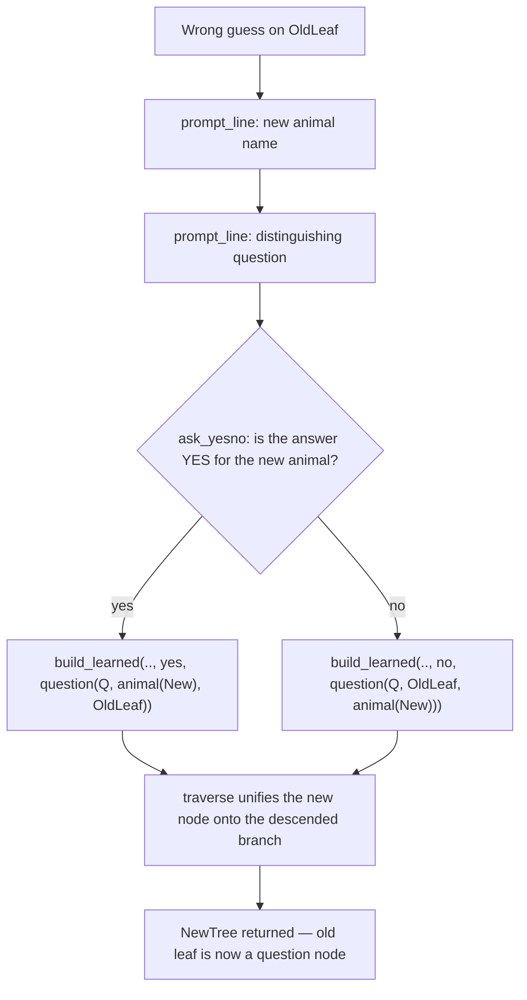
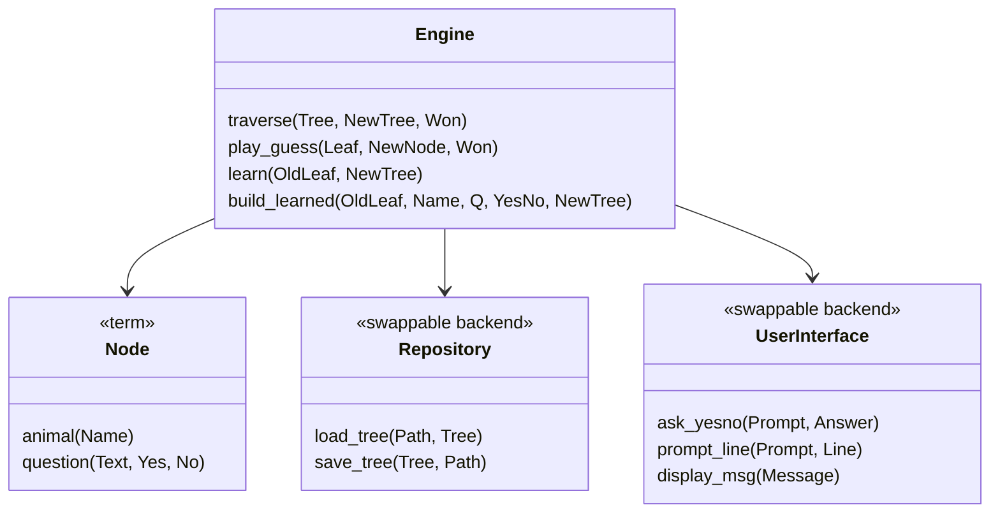
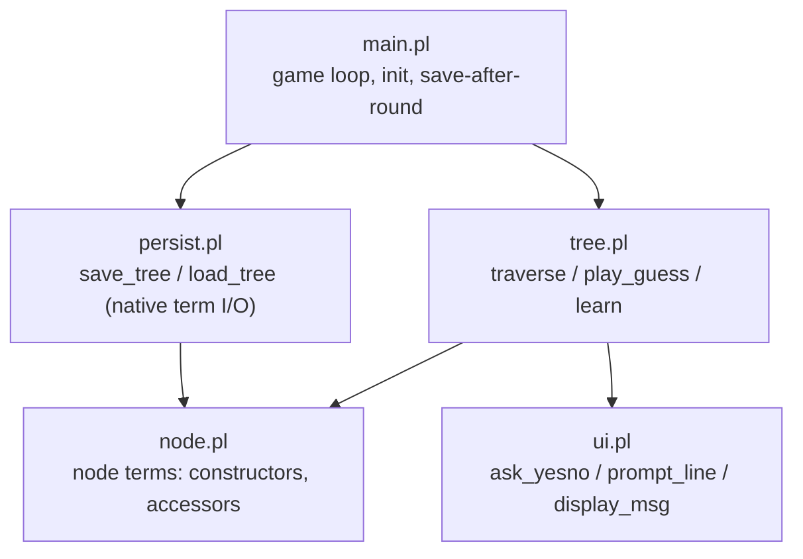
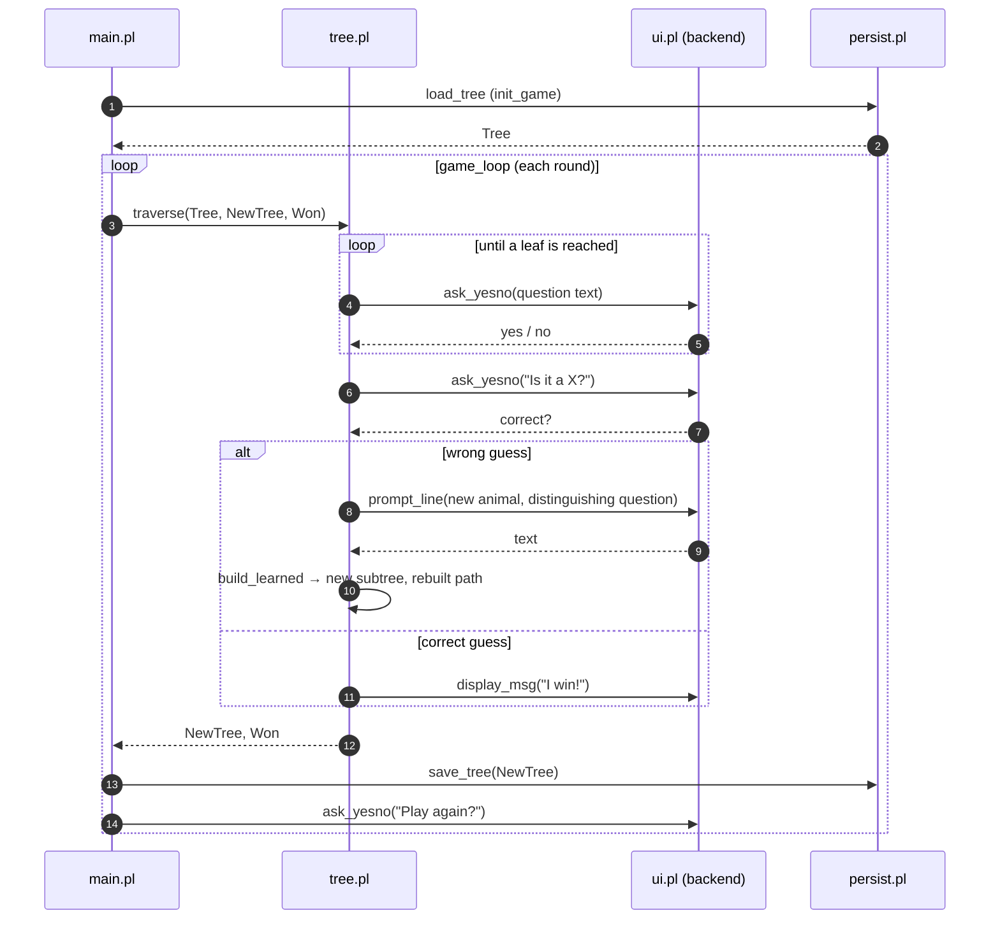

# Animal Game

**"Animal Game"** or **"Animal Guessing Game"** — a self-learning guessing game backed by a binary decision tree that grows through gameplay. This document specifies the design and its **GNU Prolog** implementation.

---

## Table of Contents

1. [Overview](#overview)
2. [Core Concept](#core-concept)
3. [Data Structure](#data-structure)
4. [Game Loop](#game-loop)
5. [Learning Algorithm](#learning-algorithm)
6. [Persistence](#persistence)
7. [Project Structure](#project-structure)
8. [Domain Model](#domain-model)
9. [Prolog Implementation](#prolog-implementation)
10. [User Interactions](#user-interactions)
11. [Acceptance Criteria](#acceptance-criteria)
12. [Constraints & Non-Functional Requirements](#constraints--non-functional-requirements)

---

## Overview

When implemented as a program, it is a classic demonstration of a **Binary Decision Tree**. The game starts knowing nothing (or just one animal) and learns new animals from the player every time it guesses wrong. Over many sessions it grows into a rich knowledge base built entirely from human input.

In Prolog the fit is unusually direct: the decision tree *is* a Prolog term, so building it is unification, walking it is pattern matching, and persisting it is the language's own read/write — no bespoke data structure, no parser.

---

## Core Concept

The game starts with a single question (e.g., *"Is it a mammal?"*). Every **Yes** or **No** answer leads to either another question node or a terminal guess (a *leaf node*).

The cool part is how it **learns**:

| Scenario | What happens |
|---|---|
| Game guesses correctly | "I win!" — round ends |
| Game guesses wrong (e.g., guesses *Dog*, player thought *Wolf*) | Game asks for a distinguishing question |
| Player provides question (e.g., *"Does it live in the wild?"*) | The old leaf (*Dog*) is replaced with a new question node; *Wolf* goes under **Yes**, *Dog* under **No** |

Over time, a completely blank program grows into a massive database of animal knowledge just by playing with humans.

---

## Data Structure

The knowledge base is a **binary tree** where every node is one of two term shapes:

```
Node
 ├── question(Text, Yes, No)   Text: atom   Yes: Node   No: Node
 └── animal(Name)              Name: atom   (leaf)
```

### Example Tree

```
question('Is it a mammal?',
         question('Does it live in the wild?', animal('Wolf'), animal('Dog')),
         question('Does it have feathers?',    animal('Parrot'), animal('Lizard')))
```

which reads as:

```
Is it a mammal?
├── YES → Does it live in the wild?
│         ├── YES → Wolf
│         └── NO  → Dog
└── NO  → Does it have feathers?
          ├── YES → Parrot
          └── NO  → Lizard
```

### Node Contract

In Prolog there are no classes or interfaces; a node is a term, and the
"interface" is a handful of predicates over its shape ([`src/node.pl`](../src/node.pl)):

```prolog
is_leaf(animal(_)).                          % leaf test
is_question(question(_, _, _)).              % internal test

node_text(animal(Name),         Name).       % the guess / question text
node_text(question(Text, _, _), Text).
node_yes(question(_, Yes, _),   Yes).        % children (question nodes only)
node_no(question(_, _, No),     No).
```

There is deliberately **no destructor**. The Forth build needed `free-node` to
release each node's heap block and string; a Prolog term is reclaimed
automatically once nothing references it.

---

## Game Loop



---

## Learning Algorithm

Triggered when the game guesses wrong.

**Inputs collected from player:**
1. The correct animal name (e.g. *"Wolf"*)
2. A yes/no question that distinguishes the new animal from the guessed one (e.g. *"Does it live in the wild?"*)
3. Whether the answer to that question is YES or NO for the new animal

**Tree transformation:**

```
Before:                     After:
  animal('Dog')         question('Does it live in the wild?',
                                 animal('Wolf'),     % YES
                                 animal('Dog'))      % NO
```

Where the Forth build *mutated* the parent cell in place, the Prolog build is
purely functional: `learn/2` **relates** the old leaf to a brand-new question
node, and `traverse/3` rebuilds the path from the root down to it, sharing every
untouched subtree by unification. Nothing is overwritten.

**The pure learning rule** — two clauses, no conditionals
([`src/tree.pl`](../src/tree.pl)):

```prolog
build_learned(OldLeaf, NewName, Question, yes,
              question(Question, animal(NewName), OldLeaf)).
build_learned(OldLeaf, NewName, Question, no,
              question(Question, OldLeaf, animal(NewName))).
```

**Control flow:**



---

## Persistence

Because a node is already a Prolog term, the tree is stored using the language's
**native reader and writer** — there is no custom format and no parser to keep
in sync with the data structure. The save file is a single readable clause:

```prolog
tree(question('Can it catch mice?',
              animal('Cat'),
              animal('Dog'))).
```

This is the direct Prolog counterpart of the Forth build's pre-order `Q`/`A`
text file: still human-readable, diffable, and hand-editable — but written by
`writeq`/`portray_clause` and read by `read/1`.

**Operations required** ([`src/persist.pl`](../src/persist.pl)):
- `load_tree(+Path, -Tree)` — read the `tree/1` clause; create the default seed
  tree if the file is absent, empty, syntactically corrupt, or structurally
  invalid.
- `save_tree(+Tree, +Path)` — write atomically (write to `<Path>.tmp`, then
  rename onto `<Path>`).

**Graceful degradation.** A missing file makes `open/3` throw; a corrupt file
makes `read/1` throw a `syntax_error`; a well-formed but wrong term (e.g.
`tree(garbage)`) is rejected by `valid_tree/1`. All three paths fall back to
`default_tree/1` (`animal('Dog')`) instead of crashing.

---

## Project Structure

```
ProAnimalGame/
├── src/
│   ├── node.pl        # node terms: constructors + accessors
│   ├── ui.pl          # abstract I/O layer (swappable backend) + input classifier
│   ├── tree.pl        # traversal and learning
│   ├── persist.pl     # save / load the decision tree (native term I/O)
│   └── main.pl        # entry point and game loop
├── tests/
│   ├── harness.pl     # assert_true / end_suite
│   ├── scripted_io.pl # scripted UI backend (test double)
│   ├── test_node.pl
│   ├── test_ui.pl
│   ├── test_tree.pl
│   └── test_persist.pl
├── data/              # persisted knowledge base (tree.pl, created at runtime)
├── docs/
│   └── AnimalGame.md
├── Makefile
└── README.md
```

---

## Domain Model



Prolog has no classes; the "interfaces" (`UserInterface`, `Repository`) are
realized as a **dynamic backend fact** plus `multifile` `backend_*` clauses, so
the concrete strategy is chosen at run time and swapped by tests without
touching the engine — the same decoupling the Forth build got from `DEFER`
words.

---

## Prolog Implementation

The abstract domain model maps onto five source modules:

| Spec concept                         | Prolog module        |
|--------------------------------------|----------------------|
| `Node` (term shapes + accessors)     | `src/node.pl`        |
| `UserInterface`                      | `src/ui.pl` (dynamic backend) |
| Engine traversal + learning          | `src/tree.pl`        |
| `Repository`                         | `src/persist.pl` (dynamic backend) |
| entry point / game loop              | `src/main.pl`        |

### Module dependencies

GNU Prolog has no module system, so sources are simply consulted in dependency
order (the Makefile does this via `--consult-file`):



### Runtime flow (one round)



### Public predicates

**`node.pl`** — a node is the term `animal(Name)` or `question(Text, Yes, No)`:
- `make_animal(+Name, -Node)` / `make_question(+Text, +Yes, +No, -Node)`
- `is_leaf(?Node)` / `is_question(?Node)`
- `node_text/2`, `node_yes/2`, `node_no/2`
- *(no destructor — terms are garbage-collected)*

**`ui.pl`** — all I/O through three predicates dispatched to the active backend
(`console` by default; tests install `scripted`):
- `ask_yesno(+Prompt, -Answer)` — the console backend re-prompts until the
  answer is a valid yes/no
- `prompt_line(+Prompt, -Line)`
- `display_msg(+Message)`
- `classify_yn(+Text, -Answer, -Valid)` — input classifier used by the console
  `ask_yesno`; first non-blank char `y`/`n` (case-insensitive), else invalid
- `set_io_backend(+Backend)` — swap the active backend

**`tree.pl`** — traversal and learning:
- `traverse(+Tree, -NewTree, -Won)` — recursive DFS relating the current tree to
  its updated form and a won/lost flag
- `play_guess(+Leaf, -NewNode, -Won)`
- `learn(+OldLeaf, -NewTree)` — collects the three inputs (interactive)
- `build_learned(+OldLeaf, +NewName, +Question, +NewAnimalIsYes, -NewTree)` —
  the pure learning rule (unit-tested with no I/O)

**`persist.pl`** — native-term save/load, a swappable *Repository*:
- `save_tree(+Tree, +Path)` — atomic (write `.tmp`, then rename)
- `load_tree(+Path, -Tree)` — falls back to `default_tree/1` on a missing, empty,
  corrupt, or structurally-invalid file
- `valid_tree(+Term)` — structural validator
- `set_repository(+Repo)` — swap the active store

**`main.pl`** — `init_game/1`, `play_round/2`, `game_loop/1`, `run_game/0`;
`save_path/1` = `data/tree.pl`.

### Key design decisions

- **Terms, not heap blocks.** A node is a first-class Prolog term. Construction
  is unification, not `ALLOCATE`; the string is an immutable atom, structurally
  shared, not a `copy-str` onto the heap; and there is no `free-node`, because
  unreachable terms are reclaimed automatically.
- **Functional tree rebuild.** `traverse/3` returns a *new* tree rather than
  mutating a cell. On a wrong guess only the path from the root to the changed
  leaf is rebuilt; every sibling subtree is shared by unification. This removes
  the Forth build's "address of the cell" bookkeeping entirely.
- **Pattern matching for dispatch.** Leaf-vs-question is decided by clause head
  unification (`animal(_)` vs `question(_,_,_)`), not a stored type flag.
- **Native persistence.** The store is the language's own reader/writer, so the
  save format and the in-memory representation can never drift apart, and a
  corrupt file is handled by the reader's own error, caught and defaulted.
- **Swappable backends.** Both the UI and the repository are selected by a
  dynamic fact and extended via `multifile` `backend_*` clauses — the Prolog
  analogue of `DEFER`. Tests install a `scripted` UI and a `stub` repository to
  exercise all logic without a terminal or the filesystem.

### Implementation notes (GNU Prolog specifics)

A few GNU-Prolog-specific points worth remembering:

- **No `read_line/1`.** GNU Prolog has no built-in line reader, so `ui.pl`'s
  `read_line_atom/1` accumulates characters with `get_char/1` until a newline or
  `end_of_file`.
- **`double_quotes` is `codes`.** Double-quoted text is a code list, not a
  string object, so all human-facing text is written as single-quoted **atoms**;
  `classify_yn/3` and the reader work in code lists (`0'y`, `0'?`).
- **`multifile` in every contributing file.** For the `console`/`scripted` and
  `file`/`stub` backends to coexist without a "redefining procedure" warning,
  each of `ui.pl`, `persist.pl`, `scripted_io.pl`, and `test_persist.pl`
  declares the relevant `backend_*` predicate `multifile` *before* its clauses.
- **`portray_clause`/`rename_file` fallbacks.** `persist.pl` prefers
  `portray_clause/2` (pretty output) and `rename_file/2` (atomic rename) but
  falls back to `writeq`+`.` and a `mv` via `system/1` if a build lacks them —
  so the save path is robust across GNU Prolog builds.
- **Directives run at consult time.** The test suites are plain `:- Goal.`
  directives executed as each file is consulted; a failing check is recorded
  (never aborts the consult) and `end_suite/1` halts with the exit status.

---

## User Interactions

### Traversal prompt

```
Does it have four legs? (yes/no): _
```

### Guess prompt

```
Is it a Dog? (yes/no): _
```

### Learning prompts (on wrong guess)

```
I give up!  What animal were you thinking of?
Animal name: _
Give me a yes/no question that tells the new animal from my guess:
Question: _
For the new animal, is the answer to your question YES? (yes/no): _
```

### Play again

```
Would you like to play again? (yes/no): _
```

---

## Acceptance Criteria

- [x] Game starts from a single default animal if no save file exists
- [x] Game correctly traverses the tree and guesses based on player answers
- [x] On a correct guess, the game announces its win and offers another round
- [x] On a wrong guess, the game collects the three learning inputs and updates the tree
- [x] The updated tree is saved to disk after every round
- [x] On next launch the tree reflects all previously learned animals
- [x] Invalid input (anything other than yes/no) is re-prompted until valid
- [x] The game handles an empty or corrupt save file gracefully (falls back to default)
- [x] All core logic (traversal, learning, tree mutation) is covered by unit tests
- [x] `UserInterface` and `Repository` are swappable so the engine is testable without I/O

---

## Constraints & Non-Functional Requirements

| Concern | Requirement |
|---|---|
| **Architecture** | The engine must not depend on concrete I/O — it depends on the abstract `ask_yesno`/`prompt_line`/`display_msg` and `load_tree`/`save_tree` predicates, whose backend is chosen at run time |
| **TDD** | All domain and engine logic written test-first |
| **SOLID** | Single-responsibility per module; open for extension (new UI or storage backends) without modifying the engine — a new `backend_*` clause plus `set_io_backend/1` / `set_repository/1` |
| **No frameworks** | Core logic is pure Prolog with zero external dependencies |
| **Question format** | Question text must end with `"?"` — `ensure_question_mark/2` appends one if the player omits it |
| **Performance** | Tree traversal is O(depth); depth is unbounded but typical sessions stay under 30 nodes |
| **Encoding** | Save file is UTF-8 Prolog source (a single `tree/1` clause); animal names and questions are atoms and support Unicode |
